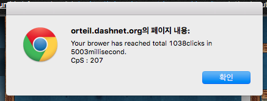
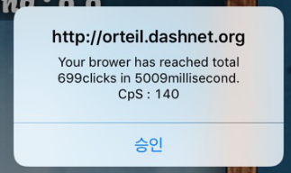
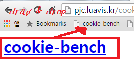

cookie-bench
====
cookie-bench is a web browser benchmark program using the 'Cookie-Clicker' game. It just clicks the cookie repeatedly using javascript's infinite loop while a few seconds.
When the evaluation time ends up, program counts the total clicks and calculates how many clicks occurred in a single second(CpS).
  
 
 

Script (Hosted)
----
[http://pjc.luavis.kr/cookie-bench](http://pjc.luavis.kr/cookie-bench)

How To Run Test
----
* __PC__
  * Click the link above.
  * Drag the 'cookie-bench' text to bookmarks bar. 
    
  * Visit [CookieClicker](http://orteil.dashnet.org/cookieclicker/) and click the bookmark which you added.
  * Wait for a few seconds and the test results will be shown on your browser.
* __iOS__
  * The screenshot goes here which describes how to run the test on DAT system.

My Results
----
|Env     | CpS |
|----|----|
|PC with Chrome | 220 |
|PC with IE11   | 95 |
|iPad Mini 4 with Chrome | 125 |

Remakrs
----
* This test is made for your funny. Do not be serious on the score you got.
* The result may depend on your browser's minimun interval policy of `setInterval` method. So it doesn't mean an actual performance.
